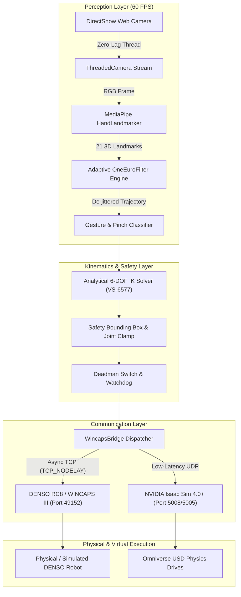
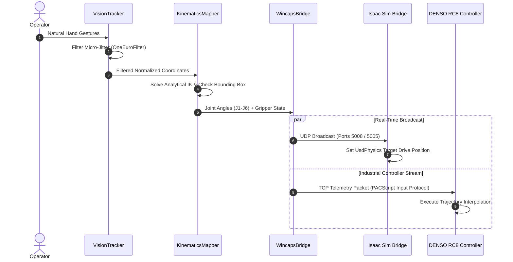

# DexDenso Teleop

<p align="center">
  
</p>

<p align="center">
  <strong>High-Precision Zero-Latency 6-DOF Vision Teleoperation & Digital Twin Framework for DENSO Industrial Robotics and NVIDIA Isaac Sim</strong>
</p>

<p align="center">
  <a href="https://github.com/MrTonyIT/dexdenso-teleop/actions/workflows/ci.yml">
    
  </a>
  <a href="https://github.com/MrTonyIT/dexdenso-teleop/blob/main/LICENSE">
    
  </a>
  <a href="https://www.python.org/downloads/">
    
  </a>
  <a href="https://developer.nvidia.com/isaac-sim">
    
  </a>
  <a href="https://developers.google.com/mediapipe">
    
  </a>
  <a href="https://www.denso-wave.com/en/robot/">
    
  </a>
</p>

---

## Overview

**DexDenso Teleop** is an industrial-grade, zero-latency computer vision teleoperation bridge designed for 6-DOF serial manipulators (specifically the **DENSO VS-6577** and **VS series**). By combining markerless bimanual hand tracking via **Google MediaPipe**, an adaptive **OneEuroFilter** signal conditioning pipeline, and closed-form **analytical inverse kinematics**, DexDenso translates natural human hand gestures into synchronized joint space telemetry for physical **DENSO RC8 / WINCAPS III** controllers and high-fidelity **NVIDIA Isaac Sim** digital twins.

### Key Capabilities

- **Zero-Latency Video Acquisition**: Multi-threaded DirectShow frame capture clearing camera ring buffers to ensure sub-1ms acquisition delay.
- **Adaptive OneEuroFilter Signal Stabilization**: Dynamic cutoff frequency scaling that eliminates human micro-tremors at rest ($f_{c,min} = 1.0\text{ Hz}$) while maintaining instantaneous velocity tracking during rapid motions ($\beta = 2.0$).
- **Dual Bimanual & Single-Hand Modes**:
  - **Bimanual Mode**: Decouples base azimuth rotation ($J_1$) and shoulder elevation ($J_2$) to the operator's non-dominant hand, while the dominant hand directs end-effector 3D reach ($J_3$), forearm roll ($J_4$), pitch tilt ($J_5$), wrist roll ($J_6$), and pinch-to-grip activation.
  - **Single-Hand Mode**: Full 6-DOF translation and orientation driven concurrently by a single tracked palm.
  - Seamless, runtime auto-detection and transition between tracking modes.
- **Analytical 6-DOF Inverse Kinematics**: Closed-form trigonometric solver with spherical wrist decoupling designed for the DENSO VS-6577 link geometry, enforcing mechanical joint limits and safety workspace bounding boxes.
- **Dual Telemetry Broadcast**:
  - Non-blocking asynchronous TCP client stream to DENSO RC8 (port 49152/5000) using `TCP_NODELAY`.
  - Zero-overhead UDP datagram broadcast (ports 5008 / 5005) directly driving `UsdPhysics.DriveAPI` angular targets in NVIDIA Isaac Sim.
- **Industrial Safety Architecture**: Integrated software Deadman switch, homing clutch calibration, and automated keep-alive watchdog.

---

## System Architecture



### Teleoperation Sequence



---

## Mathematical Formulation

### 1. Analytical Inverse Kinematics (DENSO VS-6577)

The DENSO VS-6577 is a 6-axis articulated robot with a decoupled spherical wrist. Given end-effector coordinates $(X, Y, Z)$ and wrist orientation $(\phi_{yaw}, \theta_{pitch}, \psi_{roll})$ in the base reference frame:

1. **Base Rotation ($J_1$)**:
   $$J_1 = \text{atan2}(Y, X)$$

2. **Wrist Center Position**:
   With flange offset $L_6 = 80.0\text{ mm}$:
   $$Z_{wrist} = Z + L_6, \quad R_{wrist} = \sqrt{X^2 + Y^2}$$

3. **Planar Arm Geometry ($J_2, J_3$)**:
   Upper arm length $L_2 = 365.0\text{ mm}$, forearm length $L_3 = 405.0\text{ mm}$, elbow offset $d_4 = 90.0\text{ mm}$.
   Effective forearm length:
   $$L_{3,eff} = \sqrt{L_3^2 + d_4^2}, \quad \alpha = \text{atan2}(d_4, L_3)$$
   Distance from shoulder origin to wrist center:
   $$D = \sqrt{(R_{wrist} - 75.0)^2 + (Z_{wrist} - 335.0)^2}$$
   Applying the law of cosines:
   $$\cos(\beta) = \frac{L_2^2 + L_{3,eff}^2 - D^2}{2 L_2 L_{3,eff}} \implies J_3 = (\pi - \beta) - \alpha$$
   $$\cos(\phi) = \frac{L_2^2 + D^2 - L_{3,eff}^2}{2 L_2 D}, \quad \gamma = \text{atan2}(\Delta Z, \Delta R) \implies J_2 = \frac{\pi}{2} - (\gamma + \phi)$$

4. **Wrist Decoupling ($J_4, J_5, J_6$)**:
   Tool downward constraint ($J_2 + J_3 + J_5 = 180^\circ$):
   $$J_4 = \phi_{yaw}, \quad J_5 = 180^\circ - (J_2 + J_3) - \theta_{pitch}, \quad J_6 = \psi_{roll}$$

### 2. Adaptive OneEuroFilter

To resolve the trade-off between jitter suppression and lag:
$$f_c = f_{c,min} + \beta \, |\dot{x}|$$
$$\alpha = \frac{1}{1 + \frac{\tau}{T_e}}, \quad \tau = \frac{1}{2 \pi f_c}$$
Where $f_{c,min} = 1.0\text{ Hz}$ provides complete static rejection, and $\beta = 2.0$ dynamically widens filter bandwidth during fast transitions.

---

## Directory Structure

```text
dexdenso-teleop/
├── .github/
│   └── workflows/
│       └── ci.yml               # GitHub Actions CI matrix test runner
├── .env.example                 # Environment configuration template
├── .gitignore                   # Comprehensive git exclusions
├── LICENSE                      # MIT Open Source License
├── pyproject.toml               # Modern PEP 517/621 package metadata
├── requirements.txt             # Runtime production dependencies
├── requirements-dev.txt         # Development & testing tooling
├── README.md                    # Project documentation
├── CONTRIBUTING.md              # Contributor guidelines
├── CODE_OF_CONDUCT.md           # Community code of conduct
├── hand_landmarker.task         # MediaPipe pre-trained neural model (7.8 MB)
├── kinematics_mapper.py         # Analytical 6-DOF IK & coordinate transformation
├── vision_tracker.py            # MediaPipe pipeline, OneEuroFilter, gesture tracker
├── wincaps_bridge.py            # TCP/UDP async network telemetry client
├── isaac_teleop_bridge.py       # NVIDIA Isaac Sim Script Editor receiver
├── mock_rc8_server.py           # Standalone DENSO RC8 emulator
├── main.py                      # Teleoperation orchestrator & Cyber HUD
├── test_modules.py              # Core unit test suite
├── test_integration_network.py  # Network throughput & packet integrity tests
├── RUN_TELEOP_BRIDGE.bat        # Windows 1-click teleoperation launcher
└── RESET_CAMERA.bat             # Hardware & port cleanup utility
```

---

## Installation & Setup

### Prerequisites

- **OS**: Windows 10/11 (DirectShow camera support) or Linux (V4L2)
- **Python**: 3.10, 3.11, 3.12, or 3.14
- **Webcam**: Standard USB camera (720p @ 30/60 FPS recommended)
- **Simulators** (Optional):
  - **NVIDIA Isaac Sim**: Version 2023.1.1, 4.0.0, or newer
  - **WINCAPS III**: DENSO RC8 / RC8A virtual controller simulator

### Step 1: Clone Repository & Install Dependencies

```bash
git clone https://github.com/MrTonyIT/dexdenso-teleop.git
cd dexdenso-teleop

# Create and activate virtual environment
python -m venv venv
.\venv\Scripts\activate      # On Windows
# source venv/bin/activate   # On Linux

# Install dependencies
pip install -r requirements.txt -r requirements-dev.txt
```

### Step 2: Configure Environment

Copy `.env.example` to `.env` and adjust network endpoints as needed:
```bash
cp .env.example .env
```

---

## Quickstart Guide

### Option A: Standalone Verification (No Robot Hardware Needed)

Launch the built-in DENSO RC8 mock server in one terminal:
```bash
python mock_rc8_server.py 5000
```

In a second terminal, start the teleoperation bridge:
```bash
python main.py --host 127.0.0.1 --port 5000
```
Present your hand to the camera to observe real-time 6-DOF coordinate streaming at 50–60 Hz.

---

### Option B: NVIDIA Isaac Sim Digital Twin Setup

1. Open your **DENSO VS-6577** robot USD stage in **NVIDIA Isaac Sim**.
2. Ensure robot revolute joints are named `joint_1` through `joint_6` with `UsdPhysics.DriveAPI` enabled.
3. In Isaac Sim, open **Window $\rightarrow$ Script Editor**.
4. Open or paste `isaac_teleop_bridge.py` and click **Run**.
5. Press the **Play (▶)** button on Isaac Sim's left toolbar.
6. Launch DexDenso on your workstation:
   ```bash
   python main.py
   ```
   The simulated robot arm will track your hand movements in real time.

---

### Option C: Physical DENSO RC8 / WINCAPS III Integration

1. In WINCAPS III, open **Parameter $\rightarrow$ Communication $\rightarrow$ Ethernet**.
2. Configure **Ethernet Server 1** on Port `49152` (or user port `5000`).
3. Load the PACScript communication loop into your RC8 controller:
   ```basic
   Dim posData As String
   Dim targetPos As Position
   
   Comm.Open 1
   Do
       Comm.Input #1, posData
       ' Format: X, Y, Z, Rx, Ry, Rz, Gripper
       ' Interpolate motion via Move P, ...
   Loop
   ```
4. Run the teleoperation bridge:
   ```bash
   python main.py --host 192.168.1.131 --port 49152
   ```

---

## Teleoperation Controls

| Action | Physical Gesture | System Response |
| :--- | :--- | :--- |
| **Translation ($X, Y, Z$)** | Move hand in 3D camera view | Arm translates proportionally in base frame |
| **Base Rotation ($J_1$)** | Move left hand left / right (Dual-Hand) | Arm swings base smoothly through $\pm 170^\circ$ |
| **Shoulder Elevation ($J_2$)** | Move left hand up / down (Dual-Hand) | Arm elevates shoulder |
| **Wrist Orientation ($J_4, J_5, J_6$)** | Tilt / rotate right wrist | End-effector mimics hand orientation |
| **Gripper Close / Open** | Pinch thumb & index finger | Gripper clamps (`IO[128] = ON`) / Releases |
| **Homing / Recalibrate** | Press `[r]` key | Calibrates current hand position as neutral |
| **Toggle Mode** | Press `[m]` key | Switches between Natural 3D Reach & Direct Joint mapping |
| **Adjust Sensitivity** | Press `[+]` / `[-]` | Scales motion reach sensitivity by $\pm 15\%$ |
| **Emergency Stop / Exit** | Press `[q]` or `ESC` | Freezes arm, terminates sockets safely |

---

## Automated Verification & Testing

DexDenso includes a comprehensive unit and integration test suite:

```bash
# Run full test suite with pytest
python -m pytest -v

# Run individual test harnesses
python test_modules.py
python test_integration_network.py
```

### Test Coverage Highlights

- `test_one_euro_filter`: Validates high-frequency jitter rejection ($< 0.02\text{ mm}$) and fast step transient response ($> 0.65$).
- `test_kinematics_mapper`: Validates DENSO Right-Hand Rule sign conventions, forward kinematics, and workspace boundary clamping.
- `test_packet_format`: Validates PACScript Input #1 string serialization.
- `test_bimanual_joint_mapping`: Validates dual-hand joint decoupling and wrist orientation transfer.
- `test_integration_network`: Validates 50 Hz socket burst delivery and packet framing.

---

## Safety Architecture

1. **Software Deadman Clutch**: If palm tracking is lost for $> 0.5\text{ s}$ or 20 consecutive frames, the system enters fail-safe mode, freezing the arm at its last valid setpoint.
2. **Kinematic Bounding Box**: Coordinates are strictly clamped to physical workspace envelopes ($X \in [140, 720]\text{ mm}$, $Y \in [-550, 550]\text{ mm}$, $Z \in [-20, 880]\text{ mm}$).
3. **Hardware Watchdog Keep-Alive**: When idle, a 10 Hz heartbeat is dispatched to maintain connection state without triggering unexpected motion.

---

## Contributing

We welcome contributions! Please read our [Contributing Guidelines](CONTRIBUTING.md) and [Code of Conduct](CODE_OF_CONDUCT.md) before submitting pull requests.

---

## License

This project is licensed under the **MIT License** — see the [LICENSE](LICENSE) file for details.

---

## Author & Acknowledgments

- **Tony Nguyen** ([@MrTonyIT](https://github.com/MrTonyIT)) — Computer Vision & Robotics Teleoperation Engineer
- Built with [Google MediaPipe](https://developers.google.com/mediapipe), [NVIDIA Isaac Sim](https://developer.nvidia.com/isaac-sim), and [OpenCV](https://opencv.org/).
